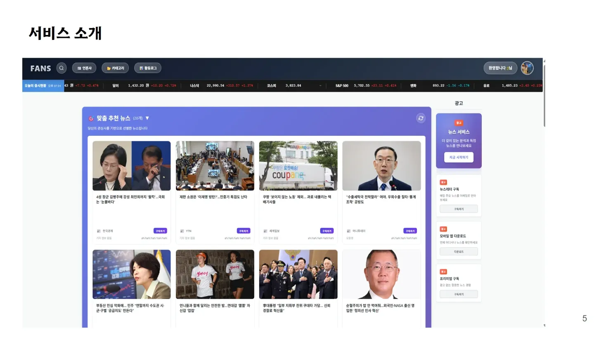
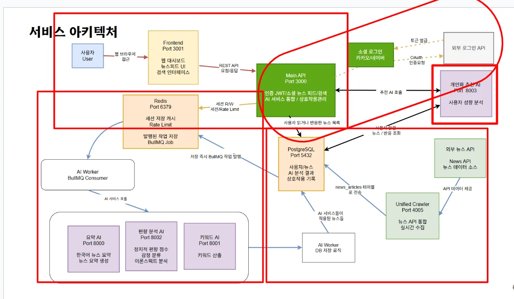
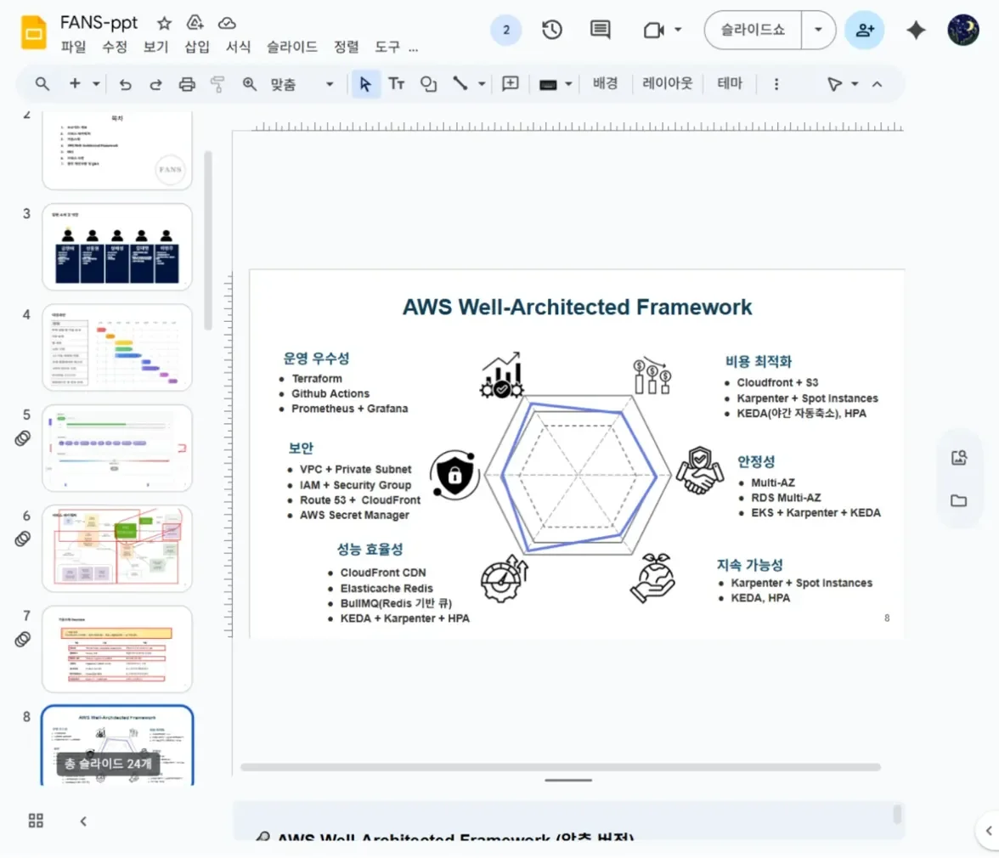
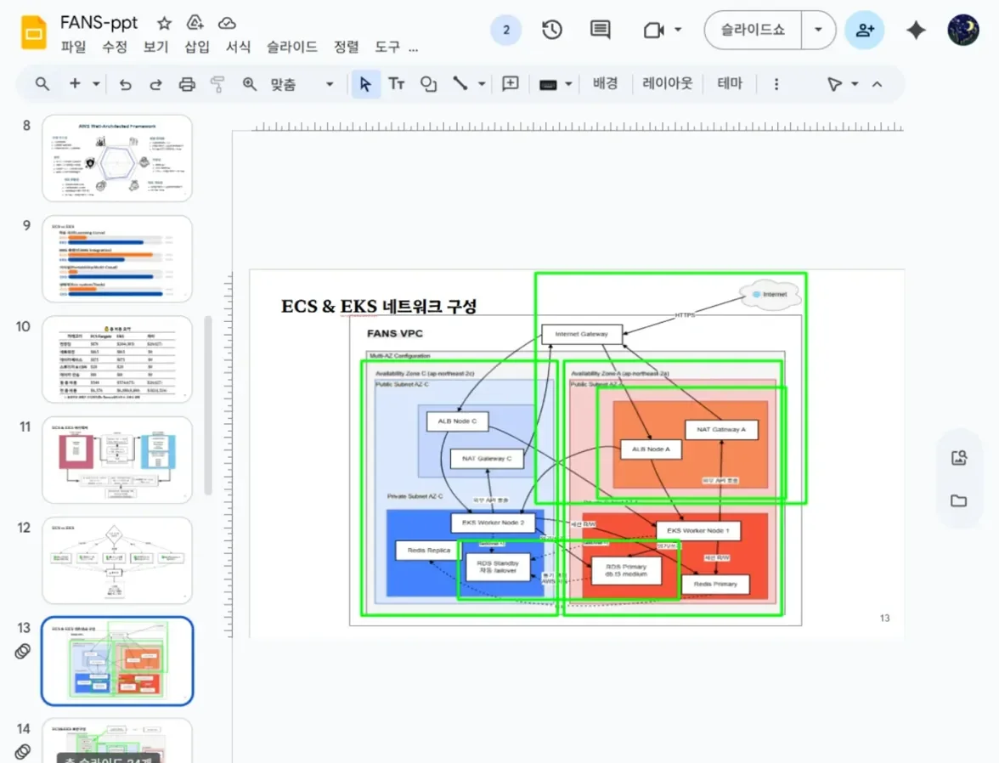
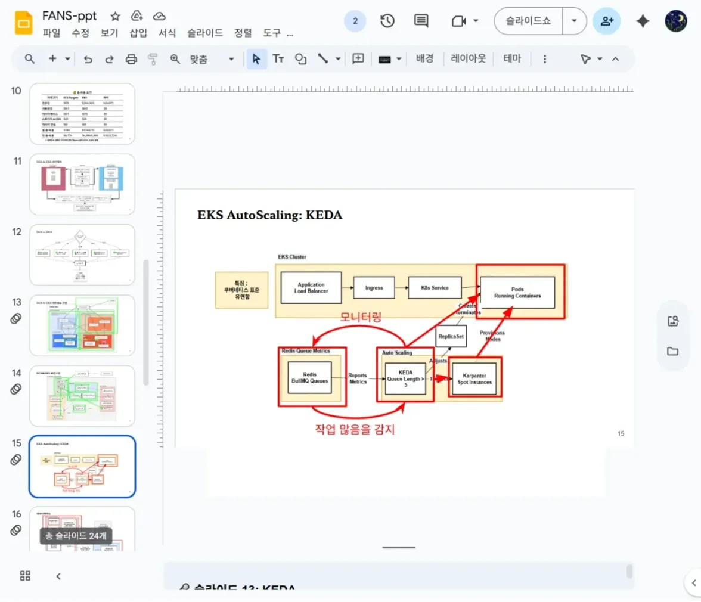
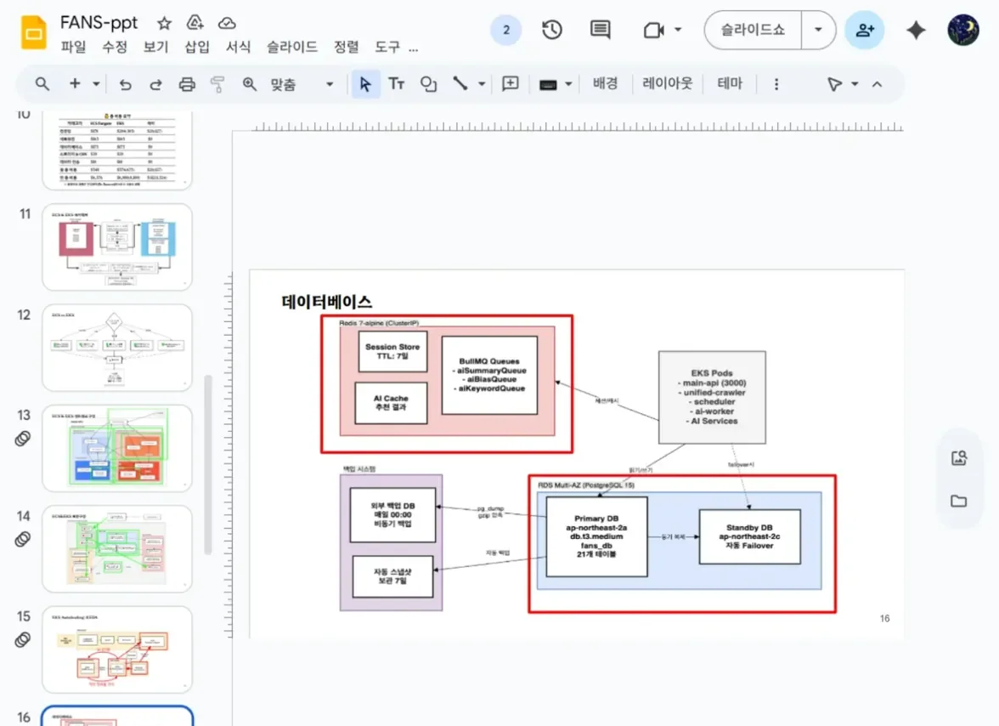
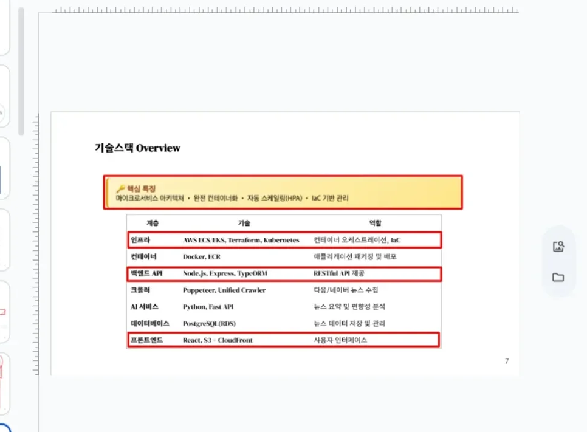
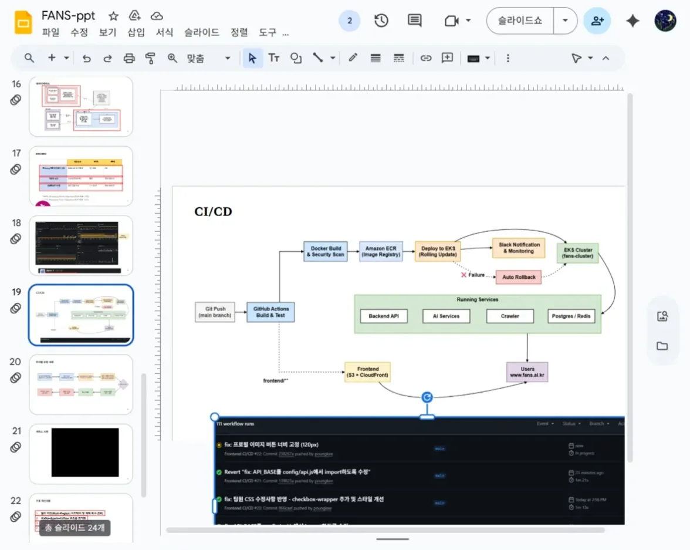
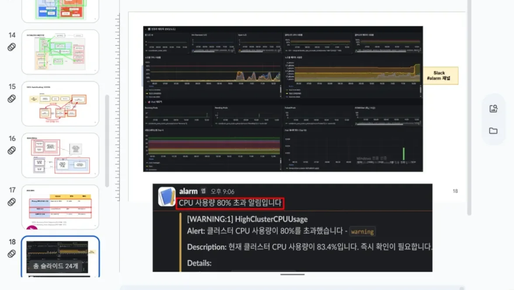
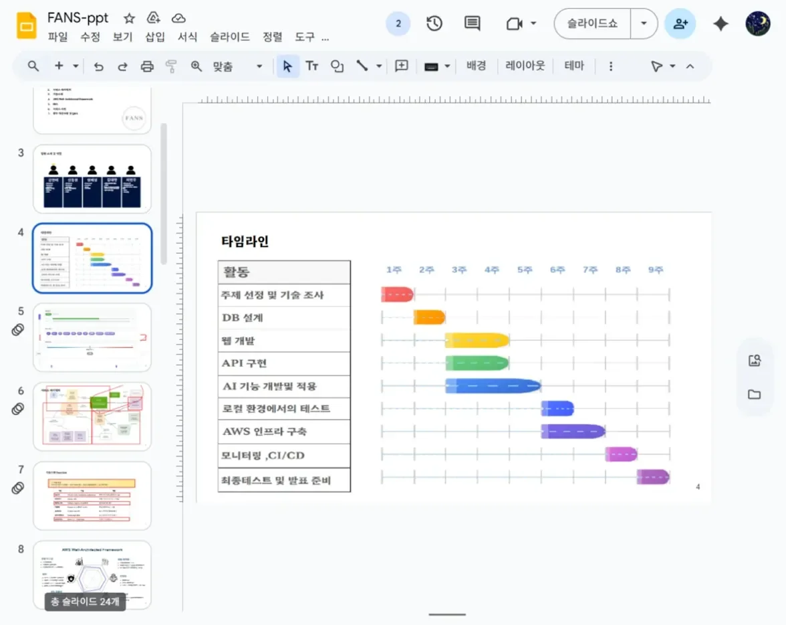

# FANS - AI 기반 뉴스 큐레이션 플랫폼

> 편향성 분석과 개인화 추천을 제공하는 클라우드 네이티브 뉴스 서비스



## 📋 프로젝트 개요

**프로젝트 기간**: 2025.05.15 - 2025.11.11 (6개월)  
**역할**: Infrastructure Architect  
**인프라 환경**: AWS EKS, Terraform, GitHub Actions

FANS는 AI 기술을 활용하여 뉴스 기사의 편향성을 분석하고 사용자 맞춤형 콘텐츠를 추천하는 마이크로서비스 기반 뉴스 플랫폼입니다. 8개의 독립적인 서비스로 구성되어 있으며, Kubernetes 기반의 자동 확장과 고가용성을 갖춘 클라우드 인프라 위에서 운영됩니다.

### 주요 기능

- 🤖 **AI 기반 콘텐츠 분석**: 한국어 T5 모델을 활용한 뉴스 요약 및 정치적 편향성 분석
- 💡 **개인화 추천**: 사용자 행동 패턴 기반 맞춤형 뉴스 추천
- 🔄 **실시간 크롤링**: 30초 주기로 다양한 언론사의 최신 뉴스 수집
- 📊 **통계 및 트렌드**: 언론사별 편향성 분석 및 7일 기준 트렌딩 뉴스
- 🔐 **소셜 인증**: JWT 기반 인증 및 카카오/네이버 소셜 로그인

---

## 🏗️ 시스템 아키텍처

### 서비스 구성



8개 마이크로서비스로 구성된 컨테이너 기반 아키텍처:

| 서비스 | 포트 | 기술 스택 | 역할 |
|--------|------|-----------|------|
| **Frontend** | 3001 | React, CloudFront | SPA 웹 인터페이스 |
| **Main API** | 3000 | Node.js, Express, TypeORM | RESTful API, 비즈니스 로직 |
| **요약 AI** | 8000 | Python, FastAPI, T5 | 뉴스 요약 생성 |
| **편향 분석 AI** | 8002 | Python, FastAPI | 정치적 편향성 검출 |
| **커뮤니티 AI** | 8001 | Python | 커뮤니티 기능 |
| **API Crawler** | 4005 | Node.js | 뉴스 수집 및 전처리 |
| **PostgreSQL** | 5432 | RDS Multi-AZ | 관계형 데이터베이스 |
| **Redis** | 6379 | ElastiCache | 캐싱, 세션, Rate Limiting |

---

## ☁️ 인프라 구성

### AWS Well-Architected Framework 적용




| 원칙 | 구현 내용 |
|------|-----------|
| **운영 우수성** | Terraform IaC, GitHub Actions CI/CD, Prometheus/Grafana 모니터링 |
| **보안** | VPC Private Subnet, Security Groups, IAM 역할 기반 접근 제어 |
| **안정성** | Multi-AZ 배포, RDS Failover, EKS AutoScaling (KEDA + Karpenter) |
| **성능 효율성** | CloudFront CDN, ElastiCache Redis, HPA/KEDA 기반 Auto Scaling |
| **비용 최적화** | Spot Instances (Karpenter), Right-sizing, On-Demand 절감 |

### 네트워크 아키텍처




**VPC 구성**
- **CIDR**: 10.0.0.0/16
- **가용 영역**: ap-northeast-2a, 2c (Multi-AZ)
- **Public Subnet**: ALB, NAT Gateway 배치
- **Private Subnet**: EKS Worker Nodes, RDS 배치

**보안 계층**
- **ALB**: HTTPS 종단점, SSL/TLS 인증서 적용
- **Security Groups**: 최소 권한 원칙 적용, 포트별 세분화된 접근 제어
- **IAM Roles**: EKS Pod별 세분화된 권한 부여
- **Route53**: 도메인 관리 및 DNS 라우팅

### EKS 클러스터 구성

**AutoScaling 전략**




1. **KEDA (Kubernetes Event-Driven Autoscaling)**
   - Redis Queue 길이 기반 Pod 자동 확장
   - Prometheus 메트릭 기반 CPU/메모리 임계값 관리
   - 워크로드별 독립적인 스케일링 정책

2. **Karpenter**
   - Spot Instances 우선 활용으로 비용 최적화
   - 노드 자동 프로비저닝 및 최적화
   - 다양한 인스턴스 타입 지원 (t3, c6i 등)

3. **HPA (Horizontal Pod Autoscaler)**
   - CPU 사용률 80% 기준 자동 확장
   - 최소 2개 ~ 최대 10개 Pod 유지

### 데이터베이스 구성




**PostgreSQL (RDS Multi-AZ)**
- **인스턴스**: db.t3.medium
- **용량**: 100GB (gp3)
- **백업**: 자동 백업 7일 보관
- **HA**: Primary + Standby (Multi-AZ)
- **복구 지표**: RTO 1분 45초, RPO 0초

**Redis (ElastiCache)**
- **용도**: 
  - Session Store (TTL 7일)
  - AI Cache (요약/분석 결과 캐싱)
  - BullMQ Job Queue (비동기 작업 관리)
- **노드**: cache.t3.medium (Replica 포함)

---

## 🔧 기술 스택

### Infrastructure




| 카테고리 | 기술 | 용도 |
|----------|------|------|
| **인프라** | AWS ECS/EKS, Terraform, Kubernetes | 컨테이너 오케스트레이션, IaC |
| **컨테이너** | Docker, Amazon ECR | 애플리케이션 패키징 및 레지스트리 |
| **백엔드 API** | Node.js, Express, TypeORM | RESTful API 개발 |
| **크롤러** | Puppeteer, Unified Crawler | 뉴스 데이터 수집 |
| **AI 서비스** | Python, FastAPI | 요약 및 편향성 분석 |
| **데이터베이스** | PostgreSQL (RDS) | 뉴스 데이터 저장 및 관리 |
| **프론트엔드** | React, S3 + CloudFront | 사용자 인터페이스 |

### DevOps & Monitoring

**CI/CD 파이프라인**




```
Git Push (main branch)
    ↓
GitHub Actions (Build & Test)
    ↓
Docker Build & Security Scan
    ↓
Amazon ECR (Image Registry)
    ↓
Deploy to EKS (Rolling Update)
    ↓
Slack Notification & Monitoring
    ↓
[Failure] → Auto Rollback
```

**모니터링 시스템**




- **Prometheus**: 메트릭 수집 (30초 간격)
- **Grafana**: 시각화 대시보드 (CPU, 메모리, 네트워크, 응답시간)
- **AlertManager**: Slack 알림 연동
- **알림 조건**:
  - CPU 사용률 80% 이상
  - 메모리 사용률 82% 이상
  - Pod Restart 발생 시
  - API 응답시간 2초 이상

---

## 📊 운영 지표

### 가용성 및 복구

| 지표 | 목표 | 달성 |
|------|------|------|
| **RTO (복구 시간)** | 2분 이내 | 1분 45초 |
| **RPO (복구 시점)** | 0초 | 0초 (실시간 복제) |
| **가동률** | 99.9% | - |
| **개발자 실수** | 스냅샷 복구 | 25분 |
| **AWS 리전 장애** | Failover | 1~2시간 (최대 24시간) |

### 비용 분석

**월간 운영 비용**: $574 (약 ₩675,000)

| 항목 | ECS Fargate | EKS | 차이 |
|------|-------------|-----|------|
| **컴퓨팅** | $178 | $204 (+$305 On-Demand) | -42% (Spot 활용) |
| **네트워킹** | $165 | $165 | - |
| **데이터베이스** | $175 | $175 | - |
| **스토리지 & CDN** | $20 | $20 | - |
| **데이터 전송** | $10 | $10 | - |
| **월 총 비용** | **$548** | **$574** | +$26 |
| **연 총 비용** | $6,576 | $6,888 (+$8,100) | -$1,524 (Spot) |

**EKS 선택 이유**
- Kubernetes가 업계 표준으로 채택 (이식성)
- HPA, KEDA 등 풍부한 Auto Scaling 도구
- Helm, Prometheus 등 에코시스템 우수
- Spot Instances 활용 시 비용 절감 효과

---

## 🔍 기술적 의사결정

### 1. ECS vs EKS 비교

**EKS를 선택한 핵심 이유**

| 기준 | ECS | EKS | 결정 |
|------|-----|-----|------|
| **학습 곡선** | 낮음 | 높음 | ⚠️ 초기 러닝커브 존재 |
| **표준화** | AWS 종속적 | 업계 표준 | ✅ 이식성 확보 |
| **Auto Scaling** | 기본 지원 | HPA, KEDA, Karpenter | ✅ 고급 기능 |
| **도구 생태계** | 제한적 | 풍부함 (Helm, Operator) | ✅ 확장성 우수 |
| **비용** | $548/월 | $574/월 | ⚠️ +$26 (Spot으로 절감) |

**결론**: 초기 비용은 소폭 증가하지만, 장기적인 확장성과 표준 기술 스택 확보를 위해 EKS 선택

### 2. IaC (Infrastructure as Code) 전략

**Terraform 도입 효과**
- 인프라 버전 관리 및 변경 이력 추적
- 재현 가능한 환경 구축 (Dev/Staging/Prod)
- 수동 작업 오류 방지
- 팀원 간 인프라 공유 및 협업 용이

**주요 모듈**
```
terraform/
├── modules/
│   ├── vpc/           # VPC, Subnet, NAT Gateway
│   ├── eks/           # EKS Cluster, Node Groups
│   ├── rds/           # PostgreSQL Multi-AZ
│   ├── elasticache/   # Redis Cluster
│   └── monitoring/    # Prometheus, Grafana
└── environments/
    ├── dev/
    ├── staging/
    └── prod/
```

### 3. 데이터베이스 설계

**13개 테이블 구조**
- `users`, `user_preferences`, `user_actions`: 사용자 관리
- `news_articles`, `sources`, `categories`, `keywords`: 뉴스 데이터
- `ai_recommendations`, `bias_analysis`: AI 분석 결과
- `article_stats`, `bookmarks`: 통계 및 상호작용

**최적화**
- PostgreSQL Full-Text Search (tsvector) 활용
- 인덱싱 전략: B-Tree (ID, 날짜), GIN (검색 벡터)
- JSONB 타입 활용으로 유연한 스키마 설계

---

## 🐛 트러블슈팅 사례

### 문제 1: 대량 크롤링 시 Pod 메모리 부족

**상황**
- 실시간 크롤링 중 Pod OOMKilled 빈번 발생
- Puppeteer 브라우저 인스턴스가 메모리 누적

**해결**
1. **BullMQ Job Queue 도입**: 크롤링 작업을 비동기 큐로 분산
2. **Worker Node 증설**: KEDA를 통한 Queue 길이 기반 Auto Scaling
3. **리소스 Limit 조정**: Memory Request 512Mi → 1Gi, Limit 1Gi → 2Gi
4. **메모리 프로파일링**: Puppeteer 브라우저 인스턴스 재사용 및 주기적 재시작

**결과**: OOMKilled 발생률 95% 감소, 크롤링 안정성 확보

---

### 문제 2: AI 서비스 응답 지연

**상황**
- 요약 AI 호출 시 평균 응답시간 5초 → 사용자 경험 저하
- T5 모델 추론 시간이 병목

**해결**
1. **Redis 캐싱 도입**: 동일 기사에 대한 요약 결과 캐싱 (TTL 7일)
2. **배치 처리**: 여러 요약 요청을 묶어서 처리
3. **Model Warm-up**: Pod 시작 시 모델 사전 로딩
4. **Rate Limiting**: API 호출 제한으로 과부하 방지

**결과**: 캐시 히트율 87%, 평균 응답시간 0.3초로 개선

---

### 문제 3: Prometheus CPU 사용률 80% 알람 오탐

**상황**
- 정상 트래픽에도 CPU 80% 경고 알람 빈번 발생
- AlertManager 알림 피로도 증가

**해결**
1. **임계값 재조정**: CPU 80% → 83% (데이터 분석 기반)
2. **Alert Grouping**: 5분 이내 동일 알람 그룹화
3. **HPA 우선 대응**: Auto Scaling이 먼저 동작하도록 설정 조정
4. **Silence 규칙 추가**: 배포 중에는 알림 일시 중지

**결과**: 오탐률 70% 감소, 실제 장애 대응력 향상

---

## 📈 프로젝트 타임라인




**전체 기간**: 9주 (2025.05 - 2025.11)

| 주차 | 활동 | 주요 산출물 |
|------|------|-------------|
| **1주** | 주제 선정 및 기술 조사 | 프로젝트 기획서 |
| **2주** | DB 설계, 주제 선정 | ERD, API 명세서 |
| **3주** | 웹 개발 | 프론트엔드 초기 버전 |
| **4주** | API 구현 | RESTful API |
| **5주** | AI 기능 개발 및 적용 | 요약/편향 분석 모델 |
| **6주** | 로컬 환경에서의 테스트 | 통합 테스트 |
| **7주** | AWS 인프라 구축 | EKS Cluster, RDS 구축 |
| **8주** | 모니터링, CI/CD | Prometheus, GitHub Actions |
| **9주** | 최종 테스트 및 발표 준비 | 성능 테스트, 문서화 |

---

## 🚀 Getting Started

### Prerequisites

- AWS CLI configured
- kubectl installed
- Terraform v1.5+
- Docker

### Quick Start

```bash
# 1. Clone repository
git clone https://github.com/FANS-hi/FANS.git
cd FANS

# 2. Infrastructure setup
cd terraform/prod
terraform init
terraform apply

# 3. Deploy to EKS
kubectl apply -f k8s/

# 4. Access application
kubectl get svc frontend-service
```

### Environment Variables

```bash
# Backend API
DB_HOST=<RDS_ENDPOINT>
DB_PORT=5432
DB_USER=fans_user
DB_PASSWORD=<SECRET>
JWT_SECRET=<SECRET>
REDIS_HOST=<ELASTICACHE_ENDPOINT>

# AI Services
GEMINI_API_KEY=<SECRET>
```

---

## 📚 Documentation

- [API 명세서](docs/API.md)
- [데이터베이스 스키마](docs/DATABASE.md)
- [인프라 구성도](docs/INFRASTRUCTURE.md)
- [트러블슈팅 가이드](docs/TROUBLESHOOTING.md)

---

## 🔗 Links

- **GitHub Repository**: [FANS-hi/FANS](https://github.com/FANS-hi/FANS)
- **Project Presentation**: [Google Slides](https://docs.google.com/presentation/d/1cli8FphKIQe4qTAql0E_NnsSCOHVY_zLG7HPMPaGv_I)

---

## 📞 Contact

**Email**: spacealp3@naver.com  
**GitHub**: [@FANS-hi](https://github.com/FANS-hi)

---

## 📝 License

This project is licensed under the MIT License.

---

## 🙏 Acknowledgments

**교육 과정**: 한국표준협회 - Cloud DX Academy (더존비즈온)  
**기간**: 2025.05 - 2025.11 (960시간)  
**분류**: K-디지털 트레이닝 클라우드 인프라 엔지니어링 과정

---

**Last Updated**: 2025.11.18